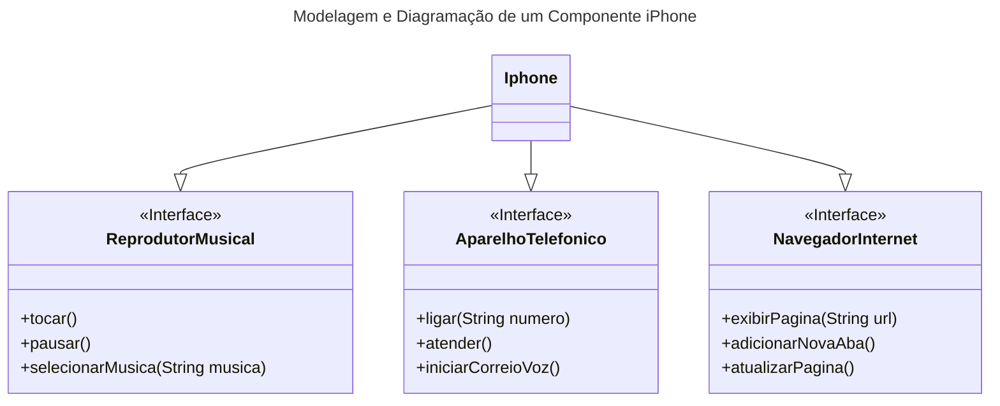

## Autor

- [Luiz Vieira](https://github.com/Zuleff)

## POO - Desafio

### Diagrama UML (Mermaid)

```mermaid
---
title: Modelagem e Diagramação de um Componente iPhone
---
classDiagram

    class Iphone{
    }


    class ReprodutorMusical{
        +tocar()
        +pausar()
        +selecionarMusica(String musica)
    }
    <<Interface>>ReprodutorMusical

    class AparelhoTelefonico{
        +ligar(String numero)
        +atender()
        +iniciarCorreioVoz()
    }
    <<Interface>>AparelhoTelefonico

    class NavegadorInternet{
        +exibirPagina(String url)
        +adicionarNovaAba()
        +atualizarPagina()
    }
    <<Interface>>NavegadorInternet

    Iphone --|> ReprodutorMusical
    Iphone --|> AparelhoTelefonico
    Iphone --|> NavegadorInternet

```
